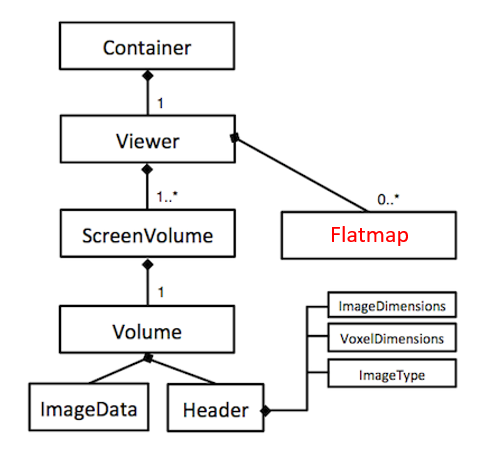
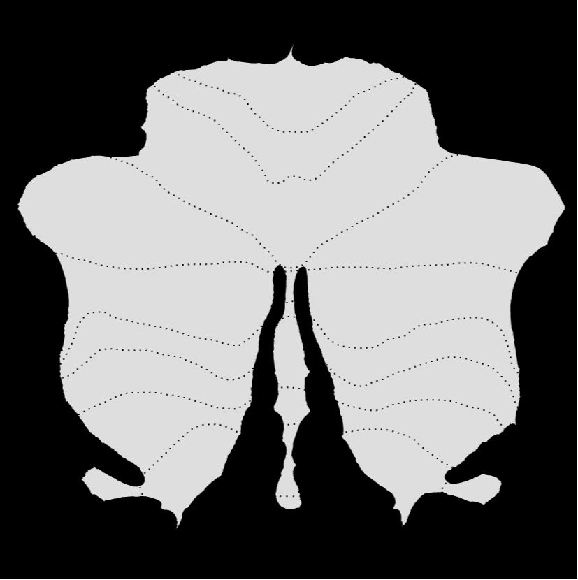
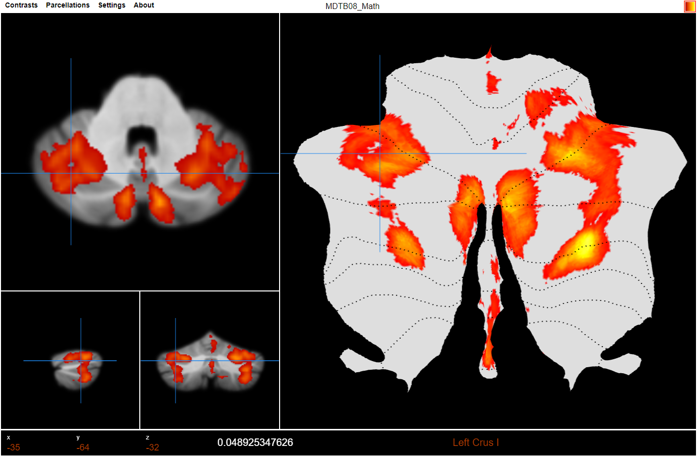
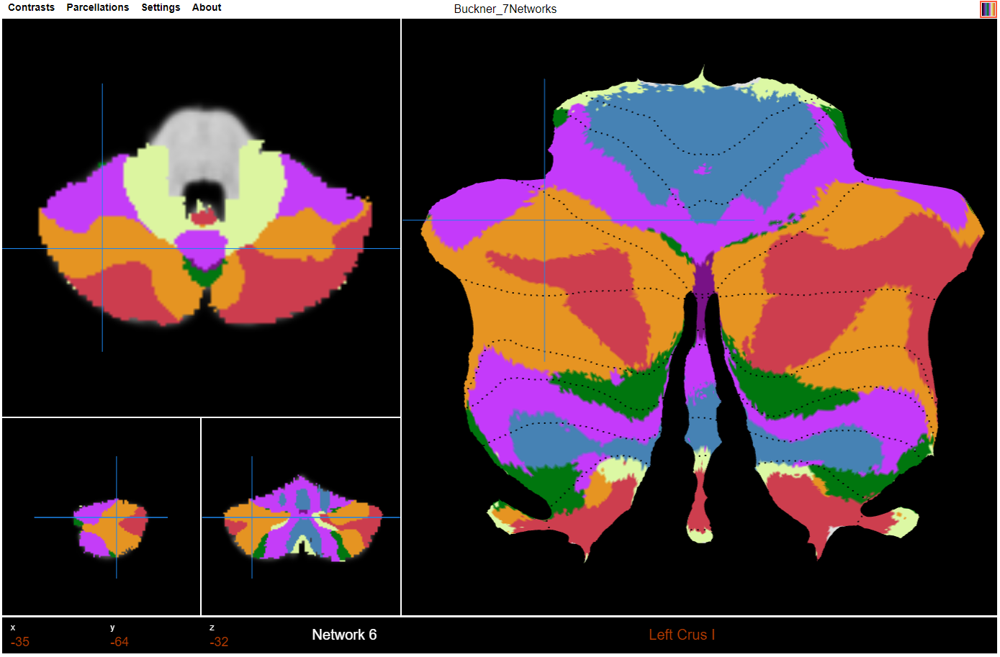

SuitPapaya
====
Diedrichsen Lab, Western University

SUITPapaya is a project of the Diedrichsen lab to build and html-based viewer for functional and other atlas data for the human cerebellum in SUIT or MNI space, including interactive visualization on the SUIT flatmap. 
The code is extensively based on the repository [rii-mango/Papaya](https://github.com/rii-mango/Papaya).

For information on SUIT and an online version of the viewer, please visit [here](diedrichsenlab.org/imaging/suit.htm).


SUITPapaya extension
------
### SUIT flatmap development
One of the major changes in SUITPapaya is we adaptively re-allocate the surface viewer object as a webgl object to render 
the cerebellum flatmap in order to synchronize with the SUIT volume viewer. These changes are mainly at ``src/js/viewer/screensurface.js``



The hierarchical class structure callback is shown in above diagram where the new flatmap object is a viewer instance. So we can access it by

```
var flatmap = papayaContainers[0].viewer.ScreenSurface[0];
```
After a `ScreenSurface` instance (flatmap in SUITPapaya) is initialized, it loads all necessary files for rendering the underlay of the cerebellum flatmap
including:
```
data/flatmap_boader.csv           --> the boader vertices based on lobular_SUIT regions
data/flatmap_edges.csv            --> the flatmap edge information for webgl rendering buffer
data/flatmap_vertices.csv         --> the flatmap vertices information for webgl vetex buffer
data/index_3dCoord.csv            --> the mapping from flatmap indices to the 3d coordinates in th volume
data/mapping_250_rerefine.csv     --> this file is the projection of the whole cerebellum flatmap into a 250*250 grid
```

We take advantage of using the `papaya.viewer.lowerImageBot2` instance as the new flatmap placeholder by re-defining the 
relative positions to the 3d volume object on the page to make it at the right place. Detailed code located at function
```
papaya.viewer.Viewer.prototype.calculateScreenSliceTransforms = function () {}
```
#### Flatmap as a Webgl object
The main reason of using webgl to design of the cerebellum flatmap is the rendering speed consideration since the underlay
cerebellum flatmap 28935 vertices and 56588 edges. All changes and webgl design located at `src/js/viewer/screensurface.js`
The vertex and fragment shaders as shown below since we think the flatmap should only be rendered on 2d plane.


```
/*** Shaders ***/
let vertexShaderText =
    [
        'precision mediump float;',

        'attribute vec2 vertPosition;',
        'attribute vec3 vertColor;',

        "uniform bool uCrosshairs;",

        'varying vec3 fragColor;',
        '',
        'void main()',
        '{',
        '  fragColor = vertColor;',
        '  gl_Position = vec4(vertPosition, 0.0, 1.0);',
        '  gl_PointSize = 2.0;',
        '}'
    ].join('\n');

let fragmentShaderText =
    [
        'precision mediump float;',

        "uniform bool uCrosshairs;",

        'varying vec3 fragColor;',
        'void main()',
        '{',
        '    gl_FragColor = vec4(fragColor, 1.0);',
        '    if (uCrosshairs) {',
        '       gl_FragColor = vec4(0.10980392156863, 0.52549019607843, 0.93333333333333, 1.0);',
        '    } else {',
        '       gl_FragColor = vec4(fragColor, 1.0);',
        '    }',
        '}'
    ].join('\n');
```


### Details of how volume/flatmap mapping and mouse censor synchronization works
#### 1. From flatmap to volume mapping
```
mouse censor pixel -> flatmap 250 resolution mapping -> index -> 3d coordinate of the volume space
```
The real-time mapping of the crosshair from flatmap (surface instance) to the 3d volumes is achieved using `data/mapping_250_rerefine.csv` 
which projects the whole cerebellum flatmap into a 250*250 resolution grid. The value on the grids is the indices of the flamap (0 value on a 
grid means this area is outside of the cerebellum flatmap). Then, we use this 250 by 250 flatmap to resize to any given webgl 
canvas of arbitrary width and height by the ratio. 

For example, if the webgl object window is width 500 * height 500, then the first 2*2 square pixels at the upper left corner will 
be projected to the 250 flatmap(0,0) value. And every time the mouse censor is located to these 4 pixels, it will always be mapped to
the indices on 250 grid (0,0).

After we get the index of the mouse censor pixel, we use `data/index_3dCoord.csv ` to lookup the 3d coordinates by the index.
And this coordinates value will be passed to `viewer.currentCoord.x`, `viewer.currentCoord.y`, and `viewer.currentCoord.z` to
synchronize the 3d volume instances crosshair. 

```
// Update the current 3D coordinates in the three viewers
if (idx > 0 && idx <= 28935) {
    this.viewer.currentCoord.x = Number(this.surfaces[index].index2Coords[idx - 1][1]);
    this.viewer.currentCoord.y = Number(this.surfaces[index].index2Coords[idx - 1][2]);
    this.viewer.currentCoord.z = Number(this.surfaces[index].index2Coords[idx - 1][3]);
    console.log(this.surfaces[index].index2Coords[idx - 1]);
}
```
#### 2. From 3d volume to flatmap mapping
```
mouse censor clicked on whichever three volumes (current x, y, z) -> index -> 2d coordinates at flatmap
```

The mapping from 3d volume to the flatmap is much easier. When a volume is clicked `this.viewer.selectedSlice = True`,
we just call function `papaya.volume.Volume.prototype.getVoxelAtMM()` by passing current x, y, and z in the 3d volume to get the index value stored at that coords, such as,

```
let val = papayaContainers[0].viewer.screenVolumes[1].volume.getVoxelAtMM(this.currentCoord.x, this.currentCoord.y, this.currentCoord.z, 0, true);
```
the `val` is the index of vertices stored in `data/flatmap_vertices.csv` then transfer to x, y coordinates on the flatmap for rendering.

```
if (val !== 0) {
    let currentcenterX = this.surfaces[index].triangleVerticesMap[(val - 1) * 2];
    let currentcenterY = this.surfaces[index].triangleVerticesMap[(val - 1) * 2 + 1];

    // crosshair X
    x_crosshair[0] = -this.xHalf/100 + currentcenterX;
    x_crosshair[1] = currentcenterY;

    x_crosshair[2] = this.xHalf/100 + currentcenterX;
    x_crosshair[3] = currentcenterY;

    // crosshair Y
    y_crosshair[0] = currentcenterX;
    y_crosshair[1] = -this.yHalf/100 + currentcenterY;

    y_crosshair[2] = currentcenterX;
    y_crosshair[3] = this.yHalf/100 + currentcenterY;

}
```

### Loading volume .nii and flatmap .gii at the same time
The three volume viewers load NIFTI file data, while the flatmap viewer needs the color information of vertices from .gii file for rendering.
To communicate the three volume viewer to the flatmap viewer, the two part are loaded at the same time. This function is
achieved in `src/js/ui/toolbar.js` at `papaya.ui.Toolbar.prototype.doAction` function callback.

For all contrast files, we set the action start with `OpenBoth-` in `papaya.ui.Toolbar.FILE_MENU_DATA` list. Then the function
load both contrast .nii and func.gii at the same time to the viewer.

For all parcellation files, we set the action start with `OpenLabel-` in `papaya.ui.Toolbar.MENU_DATA` list. Then the function callback
lookup both parcellation .nii file and label.gii at the same time by the file name suffix to '-'.

&nbsp;&nbsp;&nbsp;

For both contrast and parcellation loading, they eventually call the instance constructor of both volume instance and surface (flatmap) instance at

```
this.viewer.loadImage(NiifileName, true, false, false);
this.viewer.loadSurface(GiifileName, true, false);
```

where `NiifileName` and `GiifileName` should align with the file name that stored in `data/cerebellar_atlases/con-MDTB`. Close the 
current top overlay is achieved by:

```
else if (action.startsWith("CloseOverlay")) {
    imageIndex = parseInt(action.substring(action.lastIndexOf("-") + 1), 10);
    this.container.viewer.surfaces[0].colorsData = null;
    this.container.viewer.removeOverlay(imageIndex);
}
```

### Color Table for overlay
The color tables for label gii in the volume viewers are all hard-coded in `src/js/viewer/colortable.js`. When a `papaya.viewer.ColorTable`
instance is created, viewer will lookup the according color table by the unique name which stored in `papaya.viewer.ColorTable.OVERLAY_COLOR_TABLES`
and `papaya.viewer.ColorTable.TABLE_ALL`.

Each color table is an unique instance that stores all attributes of that functional overlay. For example, `papaya.viewer.ColorTable.TABLE_MDTB10` stores
all color information for MDTB10 parcellation, such as `"name"`, color `"data"`, and `"gradation" = True` means the colors are gradually interpolated and
rendered on the screen.

```
papaya.viewer.ColorTable.TABLE_MDTB10 = {"name": "atl-MDTB10_sp-SUIT", "data": [[0, 0, 0, 0], [0.1, 0.180392, 0.650980, 0.596078],
    [0.2, 0.333333, 0.592157, 0.125490], [0.3, 0.2, 0.4, 0.576471], [0.4, 0.058824, 0.098039, 0.494118], [0.5, 0.647059, 0.094118, 0.635294],
    [0.6, 0.686275, 0.172549, 0.278431], [0.7, 0.882353, 0.494118, 0.690196], [0.8, 0.925490, 0.631373, 0.031373],
    [0.9, 0.988235, 0.854902, 0.462745], [1, 0.466667, 0.462745, 0.964706]], "gradation": true};
```

### CSS part: Menu drop down design using .json file (Ongoing)
We are currently working on the menu bar to adaptively aligned with DataLad format by using `.json` file. The main entry to change the 
menu bar design settings are located in `src/js/ui/toolbar.js`, where `papaya.ui.Toolbar.MENU_DATA` stores the top level menu button
and their functions; `papaya.ui.Toolbar.FILE_MENU_DATA` has all contrast map and `papaya.ui.Toolbar.MDTB_MENU_DATA` contains all parcellation
maps.

Here, we wanted to design an dynamic drop down menu bar by scanning all atlas folders stored in root folder `data/cerebellar_atlases` instead
of hard-coded all menu items. This can be achieved by reading the folder `.json` file. An example script is located in `papaya.ui.Toolbar.prototype.buildToolbar`
which is the main function to build top-level menu bar.

```
fetch("data/cerebellar_atlases/package_description.json").then(function (resp) {
         return resp.json();
     }).then(function (data) {
         console.log(data);
});
```

### Desired Menu behavior 
1. data/cerebelllar atlasses should be replaced with https://github.com/DiedrichsenLab/cerebellar_atlases

2. Atlas menue titles are populated by `package_description.json.Atlas` 
3. Once the used chooses one of the menue items, a dialog (modal)/ submenue opens and displays all the Maps associated with the chosen atlas.
4. Ideally the `package_description.json.MapDesc` is visible to the user by a)hover or by display in the title after loading   
4. Once the users selects a Map, an action is being called with the action `OPEN-ATLAS-MAP`. The map name contains the information of label / contast. 

Papaya
------
Papaya is a pure JavaScript medical research image viewer, supporting [DICOM and NIFTI formats](https://github.com/rii-mango/Papaya/wiki/Supported-Formats), compatible across a [range of web browsers](https://github.com/rii-mango/Papaya/wiki/Requirements).  This orthogonal viewer supports [overlays](https://github.com/rii-mango/Papaya/wiki/Configuration#images), [atlases](https://github.com/rii-mango/Papaya/wiki/How-To-Use-Atlases), [GIFTI & VTK surface data](https://github.com/rii-mango/Papaya/wiki/Configuration#surfaces) and [DTI data](https://github.com/rii-mango/Papaya/wiki/Configuration#dti).  The Papaya UI is [configurable](https://github.com/rii-mango/Papaya/wiki/Configuration) with many [display, menu and control options](https://github.com/rii-mango/Papaya/wiki/Configuration#display-parameters) and can be run on a [web server or as a local, shareable file](https://github.com/rii-mango/Papaya/wiki/How-To-Build-Papaya).

### [Documentation](https://github.com/rii-mango/Papaya/wiki) & [Demo](http://rii.uthscsa.edu/mango/papaya/)
* [Requirements](https://github.com/rii-mango/Papaya/wiki/Requirements): Firefox (7+), Chrome (7+), Safari (6+), iOS (6+), IE (10+), Edge (12+)
* [Supported Formats](https://github.com/rii-mango/Papaya/wiki/Supported-Formats): NIFTI (.nii, .nii.gz), DICOM (compressed/uncompressed), GIFTI (.surf.gii), VTK

Quickstart Guide
------
### Development
Load `tests/debug_local.html` or `tests/debug_server.html` in your [favorite](http://www.jetbrains.com/webstorm/) JavaScript debugger.


### [Building](https://github.com/rii-mango/Papaya/wiki/How-To-Build-Papaya)
See [here](https://github.com/rii-mango/Papaya/tree/master/release) for the latest release or run `papaya-builder.sh` to create your own build.  See the [documentation](https://github.com/rii-mango/Papaya/wiki/How-To-Build-Papaya) for more information.

### [Usage](https://github.com/rii-mango/Papaya/wiki/Usage) & [Configuration](https://github.com/rii-mango/Papaya/wiki/Configuration)

#### Basic usage (loads a blank viewer)
```html
<!DOCTYPE html>
<html xmlns="http://www.w3.org/1999/xhtml" lang="en">
    <head>
        <link rel="stylesheet" type="text/css" href="papaya.css" />
        <script type="text/javascript" src="papaya.js"></script>
        <title>Papaya Viewer</title>
    </head>

    <body>
        <div class="papaya"></div>
    </body>
</html>
```

#### To automatically load images and configure other options
```html
<head>
    ...
    <script type="text/javascript">
        var params = [];
        params["worldSpace"] = true;
        params["images"] = ["data/myBaseImage.nii.gz", "data/myOverlayImage.nii.gz"];
        params["surfaces"] = ["data/mySurface.surf.gii"];
        params["myOverlayImage.nii.gz"] = {"min": 4, "max": 10};
    </script>
</head>

...

<div class="papaya" data-params="params"></div>

```

Acknowledgments
-----
Papaya uses:
- [Daikon](https://github.com/rii-mango/Daikon) for DICOM support
- [NIFTI-Reader-JS](https://github.com/rii-mango/NIFTI-Reader-JS) for NIFTI support 
- [GIFTI-Reader-JS](https://github.com/rii-mango/GIFTI-Reader-JS) for GIFTI support 

As well as the following third-party libraries:
- [bowser](https://github.com/ded/bowser) &mdash; for browser detection
- [Closure Compiler](https://developers.google.com/closure/compiler/) &mdash; JavaScript compression
- [jquery](http://jquery.com/) &mdash; DOM manipulation
- [numerics](http://numericjs.com/) &mdash; for matrix math
- [pako](https://github.com/nodeca/pako) &mdash; for GZIP inflating
